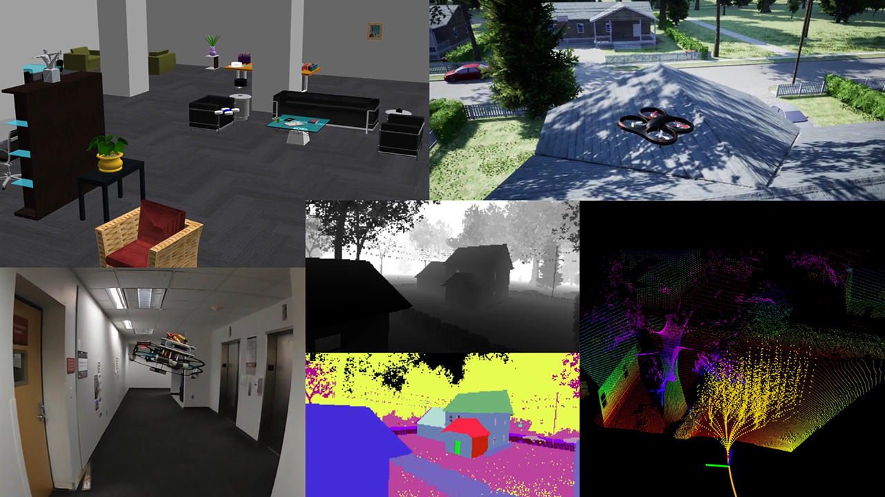
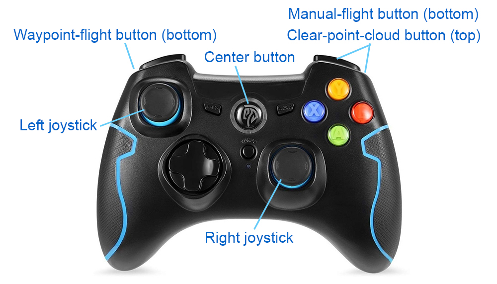
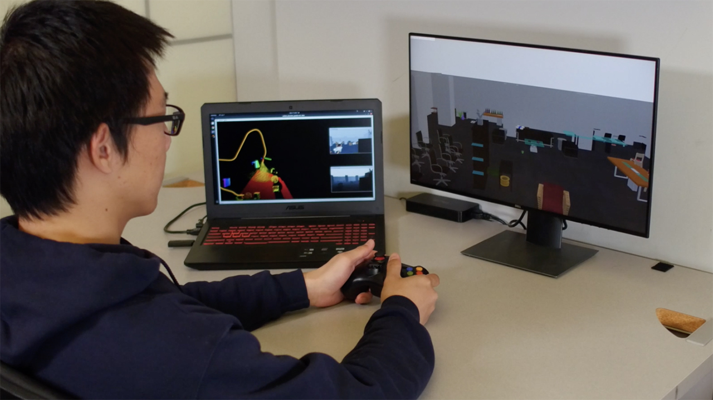
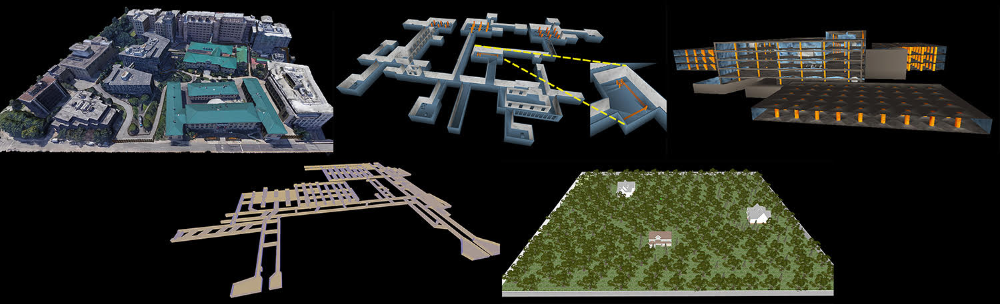

The repository is meant for leveraging system development and robot deployment for autonomous aerial navigation. Integrating Gazebo and AirSim simulators and containing autonomous navigation modules such as collision avoidance, waypoint following, and manual flight, users can develop autonomous navigation systems and later on port those systems onto real flying robots for deployment.

[A video showing functionalities of the repository available](https://youtu.be/YrtLbCC49kg).

<p align="center"></p>

The repository has been tested on our [1.8kg drone](https://youtu.be/k6jKkpmj4-k) and [10kg drone](https://youtu.be/VYtQt2NcY0Q), flying at high speeds in cluttered environments completely unknown *a priori*. Unlike many of the existing aerial systems relying on visual fiducials for detecting narrow passages and/or external motion tracking systems for acquiring state estimation, our systems use onboard range sensor data alone to compute free space and guide the vehicle through the free space safely, with all processing onboard. This repository is meant to be used for developing aerial navigation systems for real-world applications, e.g. survey, patrol, scout, and delivery, and supports our internal development of [aerial exploration](https://youtu.be/ZYNUSVqeeac).

The repository is optimized for lightweight processing. Our 1.8kg drone is equipped with a single Raspberry PI 4 computer with a 1.8GHz ARM processor. The repository consumes only ~20% of a single core on the computer, with a planning time <0.1ms. The repository is adaptable to aerial vehicles that can carry very limited computational resources to demonstrate fast responses in collision avoidance.

## Prerequisite

The repository supports *waypoint flight* - flying to a waypoint with collision avoidance, *smart joystick flight* - teleoperation with collision avoidance, and *manual flight* - standard teleoperation. To try *smart joystick flight* and *manual flight*, the system requires a PS3/4 or Xbox controller (*waypoint flight* can run without a controller). Most PS3/4 and Xbox controllers with a USB or Bluetooth interface would work out of the box (If using the Xbox Wireless USB Adapter, please install [xow](https://github.com/medusalix/xow)). The one that has been tested is an EasySMX 2.4G Wireless Controller. Some controllers have different modes. Make sure the controller is in the right mode (usually the factory default mode) and is powered on. If using the controller in the image, the two LEDs on top of the center button should be lit. Holding the center button for a few seconds changes the mode.

<p align="center"></p>

The repository has been tested in Ubuntu 18.04 with [ROS Melodic](http://wiki.ros.org/melodic/Installation) and Ubuntu 20.04 with [ROS Noetic](http://wiki.ros.org/noetic/Installation). Install dependencies with command lines below.

```sudo apt update```

```sudo apt install libusb-dev```

Clone the open-source repository.

```git clone https://github.com/caochao39/aerial_navigation_development_environment.git```

In a terminal, go to the folder and compile.


```cd aerial_navigation_development_environment```

```catkin_make```

Unzip the pre-generated motion primitives.

```unzip ./src/local_planner/paths/path_files.zip -d ./src/local_planner/paths```

Run a script to download environment models (~150MB). This may take a few minutes. If the script does not start the download, users can download the [environment models](https://drive.google.com/file/d/1W_KicQUrEEv15_zqN-ZQpjdSuxew-u6p/view?usp=sharing) and unzip the files to 'src/vehicle_simulator/meshes'.

```./src/vehicle_simulator/mesh/download_environments.sh```

Source the ROS workspace and launch ROS joystick driver.

```source devel/setup.sh```

```roslaunch ps3joy ps3.launch```

In another terminal,

```rostopic echo /joy```

Press any button on the controller and joystick messages should display in the terminal.

## Quick Start with Gazebo Simulator

In a terminal, launch the system with the command line below.

```roslaunch vehicle_simulator system_gazebo.launch```

Wait for Gazebo to initialize in a few seconds, the following scene will show up in RVIZ. Now, users can try *smart joystick flight* using the right joystick to control the flight and the left joystick to adjust the altitude while flying forward. To try *manual flight*, hold the manual-flight button on the controller and at the same time operate both joysticks in Mode 2 convention - right joystick for roll and pitch, and left joystick for yaw and altitude. Note that in real-world flights, *manual flight* is for instant repositioning of the vehicle, specifically for changing the heading and locally adjusting the 3-DOF position. The *smart joystick flight* is for continuous flight with collision avoidance to keep the vehicle safe. If users want to change the heading in the middle of a flight, for example, please switch to *manual flight* to do so. To try *waypoint flight*, send a waypoint by clicking the 'Waypoint' button in RVIZ and then clicking a point to set the waypoint. The vehicle will navigate to the waypoint avoiding obstacles along the way. Note that the waypoint should be reachable and in the vicinity of the vehicle.

<p align="center"></p>

Alternatively, users can run a ROS node to send a series of waypoints. In another terminal, go to the folder and source the ROS workspace, then run the ROS node with the command line below.

```roslaunch waypoint_example waypoint_example.launch```

Hold the waypoint-flight button on the controller and at the same time push the right joystick. The vehicle will follow the waypoints sequentially. Here, the right joystick gives the speed. If only the waypoint-flight button is held, the vehicle will fly at the minimum speed. If speed is sent from the 'waypoint_example', the system will start taking the speed in a few seconds. 

<p align="center"></p>

If a controller is unavailable, set 'autonomyMode = true' in 'src/local_planner/launch/local_planner_indoor.launch'. Launch the 'waypoint_example' together with the system. The system will start *waypoint flight*. Note that you can set 'autonomyMode = true' even if a controller is connected. Pressing any button on the controller will bring the system to *smart joystick flight* and holding the waypoint-flight button will bring the system back to *waypoint flight*.

Note that if running on a slow computer, users can change 'world_name' in 'src/vehicle_simulator/system_gazebo.launch' from 'office' to 'office_simple'. This will use a simple environment with reduced graphics rendering load. Setting 'gazebo_gui = false' will stop launching the Gazebo main window. Alternatively, users can set 'realtime_factor' to a smaller value between 0 and 1.0 to run the system at a slower speed.

## Switching to AirSim Simulator (Ubuntu 20.04 only)

Users can use [AirSim simulator](https://microsoft.github.io/AirSim) to replace [Gazebo simulator](http://gazebosim.org/) for photorealistic render and a vast set of environment models. Running AirSim simulator requires a powerful graphics card. Ideally, we would like the data render to be above 10Hz. Between 5-10Hz, the performance of the aerial navigation drops slightly. Below 5Hz, the performance drops seriously.

AirSim simulator requires Python 3.5 or later. On your computer, make sure pip3 points to Python 3.x (x>=5). Use ```pip3 --version``` to check the version. To install pip3, use ```sudo apt install python3-pip```.

```
pip3 install msgpack-rpc-python
pip3 install airsim
```

Install ROS dependencies. Replace '\<distribution\>' with 'melodic' or 'noetic' depending on the ROS distribution.
```
sudo apt install ros-<distribution>-tf2-sensor-msgs ros-<distribution>-tf2-geometry-msgs
sudo apt install ros-<distribution>-mavros*
```

Build AirSim and AirSim ROS. This requires gcc-8 or higher. Use ```gcc --version``` to check the version.

```
git clone https://github.com/Microsoft/AirSim.git
cd AirSim
./setup.sh
./build.sh
cd ros
catkin_make
```
If there are any issues to complete the steps above, please refer to this [documentation](https://microsoft.github.io/AirSim/airsim_ros_pkgs).

Download an AirSim environment from the [AirSim release page](https://github.com/Microsoft/AirSim/releases). Click any version of the releases and find the 'Assets' at the bottom of the page. The default environment that we use is named 'AirSimNH'. Download and unzip the file, then copy the 'src/airsim_utils/config/settings.json' file from the development environment to the 'AirSimNH/LinuxNoEditor' folder.

In a terminal, go to the 'AirSimNH/LinuxNoEditor' folder and launch AirSim.
```
./AirSimNH.sh -windowed
```
In a second terminal, go to the 'AirSim/ros' folder and launch AirSim ROS Wrapper.
```
source devel/setup.bash
roslaunch airsim_ros_pkgs airsim_node.launch
```
In a third terminal, go to the development environment folder and launch our system.
```
source devel/setup.sh
roslaunch vehicle_simulator system_airsim.launch
```
Now users can use the controller to try *smart joystick flight* and *manual flight*, and click the 'Waypoint' button in RVIZ to try *waypoint flight*.

<p align="center"></p>

Note that users can turn off the AirSim main window to reduce graphics rendering load and increase data render framerate, by changing 'FlyWithMe' to 'NoDisplay' in the 'AirSimNH/LinuxNoEditor/settings.json' file.

## Integrating CMU-Recon models - releasing soon (Ubuntu 20.04 only)

The system can seamlessly integrate realistic models built by the [CMU-Recon System](https://www.cmu-reconstruction.com). CMU-Recon models are made of high-fidelity lidar scans and RGB images. To try an example CMU-Recon model, go to the development environment folder in a terminal, switch to the 'noetic-cmu-recon' branch, and then compile.
```
git checkout noetic-cmu-recon
catkin_make
```
Run a script to download the CMU-Recon model. When prompted, enter 'A' to overwrite all existing files.

```./src/vehicle_simulator/cmu_recon/download_cmu_recon_model.sh```

Now users can use the command lines below to launch the system. Wait for the system to initialize in a few seconds, rendered RGB, depth, and semantic images will show in RVIZ. To view the rendered RGB or semantic point cloud, click 'Panels->Displays' and check 'ColorCloud' or 'SemanticCloud'.
```
source devel/setup.sh
roslaunch vehicle_simulator system_cmu_recon_seg.launch
```

<p align="center"></p>

## Advanced

**Changing simulation environment**: Additional five Gazebo environments are provided. In a terminal, go to the development environment folder and use the command line below to download the environments.

```./src/vehicle_simulator/mesh/download_additional_environments.sh```

Change 'world_name' in 'src/vehicle_simulator/system_gazebo.launch' to one of the the additional environment names, i.e. 'campus', 'indoor', 'garage', 'tunnel', 'forest'. If starting the vehicle at a different position, set 'vehicleX', 'vehicleY', 'vehicleZ', 'vehicleYaw'. Users can launch the system and fly in the additional environments. Note that to fly in campus environment, we recommend outdoor configuration. Use the command line below to launch the system instead.

```roslaunch vehicle_simulator system_gazebo.launch config:=outdoor```

<p align="center"></p>

To change the AirSim environment, dowmload an AirSim environment from the [AirSim release page](https://github.com/Microsoft/AirSim/releases) and copy the 'src/airsim_utils/config/settings.json' file from the development environment to the '<environment>/LinuxNoEditor' folder. Alternatively, users can use [Unreal Engine](https://www.unrealengine.com/) to prepare a custom AirSim environment. [Instructions are available here](https://microsoft.github.io/AirSim/unreal_custenv).

**Integrating on real drone**: Our system interfaces with the flight controller onboard the aerial vehicle in attitude control mode. Control commands are sent as 'geometry_msgs::TwistStamped' typed messages on ROS topic '/attitude_control'. Specifically, 'twist.linear.x' and 'twist.linear.y' in the message contain desired roll and pitch, 'twist.angular.z' contains desired yaw rate, and 'twist.linear.z' contains desired vertical speed, all in vehicle-horizontal frame with x-forward, y-left, and z-up. 

The system takes in state estimation as 'nav_msgs::Odometry' typed messages and range sensor data as 'sensor_msgs::PointCloud2' typed messages, defined in 'src/vehicle_simulator/system_gazebo.launch' and 'src/vehicle_simulator/system_airsim.launch'. In addition, the system takes in joystick input as 'sensor_msgs::Joy' typed messages on ROS topic '/joy', waypint as 'geometry_msgs::PointStamped' typed messages on ROS topic '/way_point', and speed as 'std_msgs::Float32' typed messages on ROS topic '/speed'. 

The system stacks range sensor data in a close distance (1m by default) around the vehicle to deal with the case that obstacles get too close to the range sensor and cannot be seen. To reinitialize the kept range data, send a 'std_msgs::Empty' typed message on ROS topic '/clear_surr_cloud', or press the clear-point-cloud button on the controller. For tuning control parameters, please refer to the instruction below.

**Tuning control parameters**: We use the Gazebo simulation setup as an example. In 'src/control_tuner/launch/control_test_gazebo.launch', set 'trackingCamXOffset', 'trackingCamYOffset', 'trackingCamZOffset', offsets of the state estimation sensor w.r.t. the vehicle center. Set 'trackingCamBackward = true' if the state estimation sensor points backward. Use command line below for initial parameter tuning.

```roslaunch vehicle_simulator control_test_gazebo.launch```

First execute *manual flight* by operating the two joysticks, then execute *waypoint flight* by holding the waypoint-flight button and pushing the right joystick to bring up speed. Tune 'velXYGain' and 'posXYGain', horizontal velocity and position gains in flight, 'stopVelXYGain' and 'stopPosXYGain', corresponding gains in hovering, 'posZGain' and 'maxVelByPosZ', vertical position gain and maximum speed, and 'yawGain' and 'maxRateByYaw', yaw gain and maximum yaw rate. Set 'smoothIncrSpeed', maximum speed increase in *waypoint flight*, 'minSpeed' and 'maxSpeed', minimum and maximum speed in *waypoint flight*, and 'manualSpeedXY', 'manualSpeedZ', 'manualYawRate', maximum horizontal speed, vertical speed, and yaw rate in *manual flight*.

Update the parameters tuned above in 'src/local_planner/launch/local_planner_indoor.launch'. Set 'depthCamXOffset', 'depthCamYOffset', 'depthCamZOffset', 'depthCamPitchOffset', offsets of the range sensor and pitch angle, and calibrate 'depthCloudDelay', relative latency between the range sensor and state estimation sensor. Use command line below for further parameter tuning.

```roslaunch vehicle_simulator system_gazebo.launch```

Execute *smart-joystick flight*. Make the vehicle fly straight and tune 'lookAheadScale', scale of the look-ahead distance w.r.t. speed, 'minLookAheadDis', minimum look-ahead distance. Make the vehicle fly in a circle and tune 'accXYGain', horizontal acceleration gain, 'yawBoostScale', scale for boosting yaw gain when the vehicle turns, 'slowTurnRate', rate for reduced speed when the vehicle turns, and 'minSlowTurnCurv', minimum path curvature to trigger reduced speed. Make the vehicle ascend and descend, tune 'posZBoostScale', scale for boosting vertical position gain when the vehicle ascends or descends. Execute *waypoint flight*. set 'maxElev', maximum altitude, and 'stopRotYaw1', angle of the waypoint that the vehicle stops and turns before flying toward the waypoint. Set 'saveTrajectory = true' to log desired and executed trajectories on the computer desktop. Compare the trajectories to evaluate the path following performance.

**Changing vehicle size**: The system uses motion primitives generated by a MatLab script. To change the vehicle size, adjust 'searchRadiusHori' and 'searchRadiusVert' in 'src/local_planner/paths/path_generator.m' and run the MatLab script. This will generate a set of path files in the same folder.

## License

The repository is released with a non-commercial license of Carnegie Mellon University. For commercial use, please contact the [National Robotics Engineering Center (NREC)](https://www.nrec.ri.cmu.edu/) of Carnegie Mellon University.

## Authors

[Chao Cao](http://caochao.me) (CMU Robotics Institute), [Fan Yang](https://github.com/MichaelFYang) (CMU Robotics Institute), [Sam Shum](https://github.com/supercrazysam) (CMU NREC), [Hongbiao Zhu](http://www.hongbiaoz.com) (CMU Robotics Institute), and [Ji Zhang](https://frc.ri.cmu.edu/~zhangji) (CMU NREC & Robotics Institute)

## Reference

J. Zhang, C. Hu, R. Gupta Chadha, and S. Singh. Falco: Fast Likelihood-based Collision Avoidance with Extension to Human-guided Navigation. Journal of Field Robotics. vol. 37, no. 8, pp. 1300–1313, 2020. [[**PDF**](https://frc.ri.cmu.edu/~zhangji/publications/JFR_2020.pdf)]

## Credits

Gazebo environment modes are from [3DGEMS](https://data.nvision2.eecs.yorku.ca/3DGEMS/). [joystick_drivers](http://wiki.ros.org/joystick_drivers) package is from open-source release.

## Links

[airOMPL Planner](https://github.com/MichaelFYang/airOMPL_planner): an OMPL-based route planner for aerial navigation, running on top of Aerial Navigation Development Environment.
